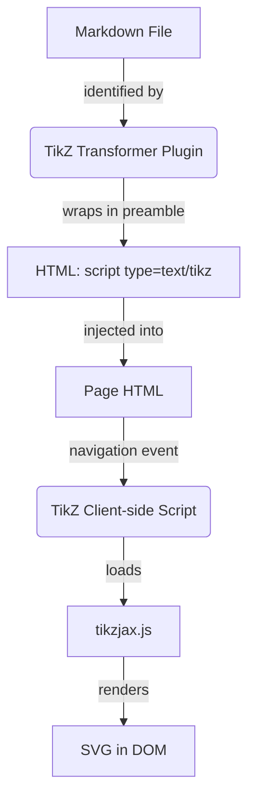

# Technical Design: TikZJax Implementation in Quartz

This document outlines the technical design for integrating TikZJax into Quartz for client-side rendering of TikZ diagrams.

## Overview

The implementation follows a client-side rendering approach, similar to how Mermaid is handled in Quartz. A transformer plugin identifies TikZ code blocks and wraps them in a specific script tag. A client-side script then loads the TikZJax library and triggers rendering.

## Architecture



## 1. Transformer Plugin: `quartz/plugins/transformers/tikz.ts`

The plugin will:
- Find code blocks with the language `tikz`.
- Wrap the content in a LaTeX preamble with required packages.
- Convert the `mdast` code node into an HTML `script` tag with `type="text/tikz"`.
- Provide `externalResources` for CSS and the client-side script.

### Required Preamble
```latex
\usepackage{chemfig}
\usepackage{tikz-cd}
\usepackage{circuitikz}
\usepackage{pgfplots}
\pgfplotsset{compat=1.16}
\usepackage{amsmath, amstext, amsfonts, amssymb}
\usepackage{tikz-3dplot}
```

### Plugin Structure (Snippet)
```typescript
export const TikZJax: QuartzTransformerPlugin = () => {
  return {
    name: "TikZJax",
    markdownPlugins() {
      return [
        () => (tree, file) => {
          visit(tree, "code", (node: Code) => {
            if (node.lang === "tikz") {
              const preamble = `...`; // user requested preamble
              const content = `${preamble}\n${node.value}`;
              node.data = {
                hName: "script",
                hProperties: { type: "text/tikz" },
                hChildren: [{ type: "text", value: content }]
              };
            }
          });
        }
      ];
    },
    externalResources() {
      return {
        css: [{ content: "https://tikzjax.com/v1/fonts.css" }],
        js: [{
          src: "https://tikzjax.com/v1/tikzjax.js",
          loadTime: "afterDOMReady",
          contentType: "external"
        }, {
          script: tikzScript, // custom logic for SPA/nav
          loadTime: "afterDOMReady",
          contentType: "inline"
        }]
      };
    }
  };
};
```

## 2. Client-side Script: `quartz/components/scripts/tikz.inline.ts`

Since Quartz uses SPA navigation, we need to ensure TikZJax re-renders when the page changes. TikZJax usually runs on load, but we might need to manually trigger it if `tikzjax.js` doesn't automatically detect new tags on SPA events.

### Script Logic
- Listen for the `nav` event.
- Check if `<script type="text/tikz">` tags exist.
- If they do, and TikZJax is loaded, trigger rendering.

## 3. Integration: `quartz.config.ts`

Add the plugin to the `transformers` array:

```typescript
transformers: [
  // ... other plugins
  Plugin.TikZJax(),
  // ...
]
```

## Open Questions / Considerations
- **Version pinning**: Should we pin `https://tikzjax.com/v1/` or host the files locally?
- **Performance**: TikZJax uses a heavy WASM TeX engine. We should ensure it only loads when needed.
- **Container**: TikZJax replaces the script tag with an SVG. We might want to wrap it in a `div` for styling/overflow handling.
